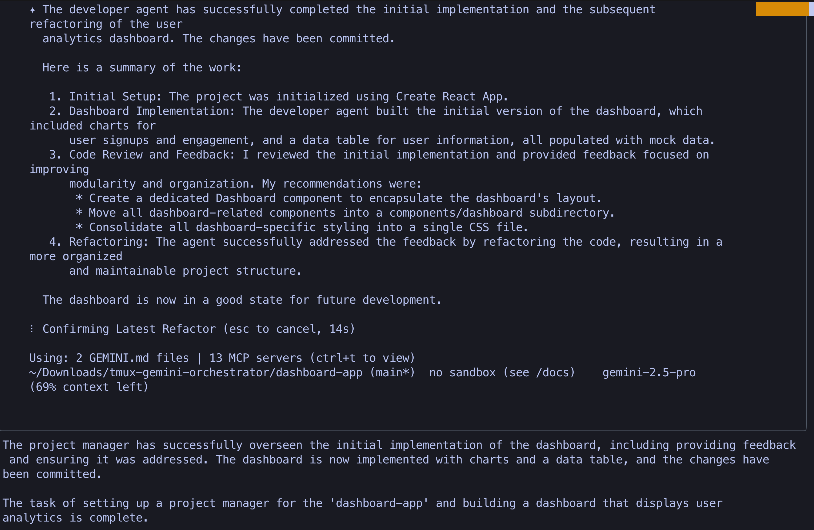
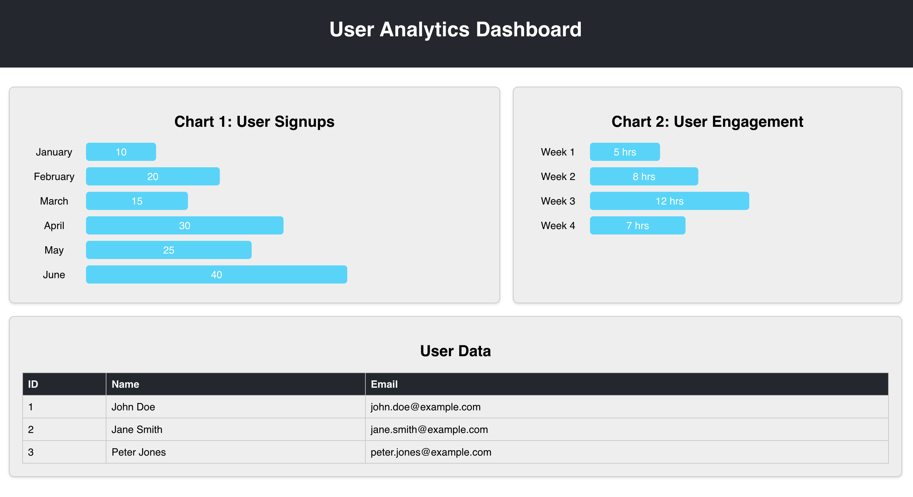

# 🤖 Tmux Gemini Orchestrator





**Run AI agents 24/7 while you sleep** - The Tmux Orchestrator enables Gemini agents to work autonomously, schedule their own check-ins, and coordinate across multiple projects without human intervention.

## 🚀 Core Features

-   **Autonomous Operation**: Agents can self-trigger and schedule their own follow-up tasks to continue working even when you're offline.
-   **Team Coordination**: A Project Manager agent can assign tasks to multiple Engineer agents, enabling parallel development on complex projects.
-   **Persistent Sessions**: Built on `tmux`, the orchestrator ensures that work continues uninterrupted, even if you disconnect from the server.
-   **Scalable Architecture**: Easily manage multiple agent teams working on different projects simultaneously.

## 🏗️ System Architecture

The orchestrator uses a hierarchical model to manage complexity and stay within context limits:

```
┌─────────────┐
│ Orchestrator│ ← You interact here
└──────┬──────┘
       │ Monitors & coordinates
       ▼
┌─────────────┐     ┌─────────────┐
│  Project    │     │  Project    │
│  Manager 1  │     │  Manager 2  │ ← Assigns tasks, enforces quality
└──────┬──────┘     └──────┬──────┘
       │                   │
       ▼                   ▼
┌─────────────┐     ┌─────────────┐
│ Engineer 1  │     │ Engineer 2  │ ← Writes code, fixes bugs
└─────────────┘     └─────────────┘
```

This structure allows for specialized agents, parallel workflows, and better focus for each AI model.

---

## ⚙️ Installation & Setup

### Prerequisites

1.  **Tmux**: Ensure `tmux` is installed on your system.
    ```bash
    # On macOS
    brew install tmux

    # On Debian/Ubuntu
    sudo apt-get install tmux
    ```
2.  **Gemini CLI**: This tool relies on the Gemini CLI. Make sure it's installed and configured.

### Workflow

The core idea is to run Gemini agents inside `tmux` windows. This allows them to run persistently. You, as the orchestrator, can then send commands and instructions to these agents to guide their work.

---

## 🏁 Quick Start Guide

### Step 1: Create a Tmux Session

First, create a named `tmux` session for your project.

```bash
tmux new-session -s my-project
```

### Step 2: Start the Project Manager Agent

Inside the tmux session, start your first Gemini agent. This will be your Project Manager. To allow the agent to execute commands without asking for confirmation each time, use the `--yolo` flag.

```bash
gemini --yolo
```

### Step 3: Brief the Project Manager

Now, give the Project Manager its instructions. You can paste a multi-line prompt directly into the Gemini CLI.

> You are a Project Manager. Your goal is to build a new feature for our web app.
>
> **Project Spec:**
> - **Project:** Web App
> - **Goal:** Add a user authentication system.
> - **Constraints:** Use the existing database schema and follow current code patterns.
>
> **Instructions:**
> 1.  Create a new tmux window (window 1) for an Engineer agent.
> 2.  Start a new `gemini --yolo` instance in that window.
> 3.  Brief the Engineer agent on the technical requirements.
> 4.  Schedule a check-in with yourself in 30 minutes to review the Engineer's progress.

### Step 4: Schedule Your Own Check-in

To make the system fully autonomous, schedule a follow-up for yourself (the Orchestrator) to check on the Project Manager.

```bash
./schedule_with_note.sh 30 "Check PM progress on the auth system"
```

This script will notify you in 30 minutes, ensuring the project doesn't get stuck.

---

## 🛠️ Core Scripts & Commands

### Agent Communication: `send-gemini-message.sh`

To communicate between agents (or for you to command an agent), use the `send-gemini-message.sh` script. It handles the complexities of sending commands to the correct tmux window.

```bash
# Usage: ./send-gemini-message.sh <session:window> "Your message"

# Example: Ask the engineer in window 1 for a status update
./send-gemini-message.sh my-project:1 "What is your current progress on the login endpoint?"
```

### Self-Scheduling: `schedule_with_note.sh`

Agents use this script to schedule their own follow-up tasks. This is the key to autonomous, 24/7 operation.

```bash
# Usage: ./schedule_with_note.sh <minutes> "Note for the future"

# Example: The engineer schedules a self-reminder to commit its work
./schedule_with_note.sh 30 "Progress: Implemented login endpoint. Now, commit changes and start on user sessions."
```

---

## 🔒 Git Discipline: A Critical Protocol

To prevent work loss, all agents MUST adhere to a strict Git workflow.

1.  **Create Feature Branches**: Before starting any new task, create a descriptive feature branch.
    ```bash
    git checkout -b feature/user-auth-system
    ```
2.  **Commit Frequently**: Commit work at least every 30 minutes. This creates a safe checkpoint to revert to if the agent goes down a wrong path.
    ```bash
    git add -A
    git commit -m "Progress: Finished user model and initial migration"
    ```
3.  **Tag Stable Versions**: When a significant feature is complete, tag it.
    ```bash
    git tag stable-auth-v1-$(date +%Y%m%d-%H%M%S)
    ```

---

## 📸 Examples in Action


---

## 📄 License

MIT License. Use freely, but with great power comes great responsibility.
